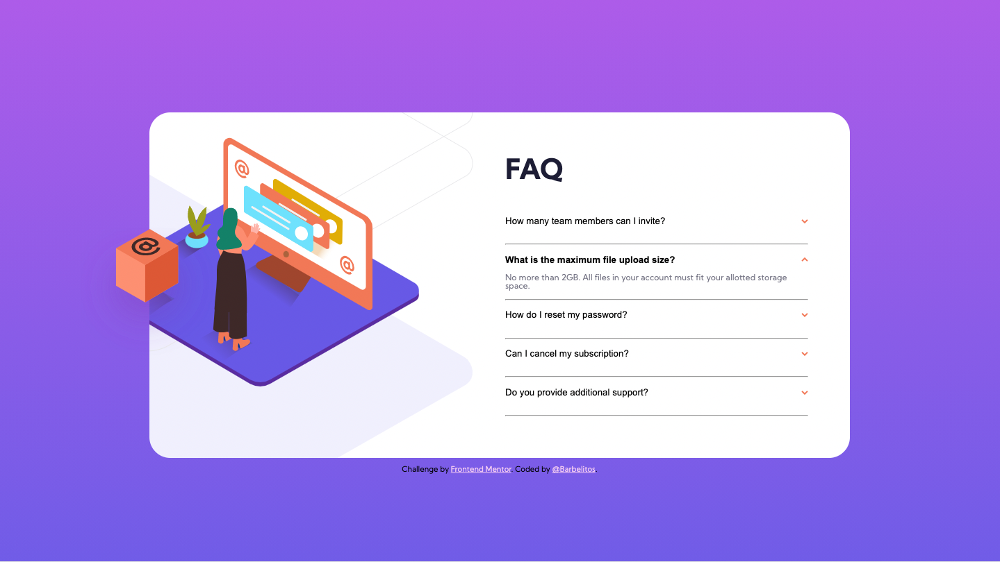

# Frontend Mentor - FAQ accordion card solution

This is a solution to the [FAQ accordion card challenge on Frontend Mentor](https://www.frontendmentor.io/challenges/faq-accordion-card-XlyjD0Oam). Frontend Mentor challenges help you improve your coding skills by building realistic projects. 

## Table of contents

- [Overview](#overview)
  - [The challenge](#the-challenge)
  - [Screenshot](#screenshot)
  - [Links](#links)
- [My process](#my-process)
  - [Built with](#built-with)
  - [What I learned](#what-i-learned)
  - [Continued development](#continued-development)
  - [Useful resources](#useful-resources)
- [Author](#author)
- [Acknowledgments](#acknowledgments)

## Overview

### The challenge

Users should be able to:

- View the optimal layout for the component depending on their device's screen size
- See hover states for all interactive elements on the page
- Hide/Show the answer to a question when the question is clicked

### Screenshot

### Links

- [Solution URL](https://barbelitos.github.io/FrontEndMentor-AccordionCard/)

## My process

### Built with

- Mobile-first workflow
- HTML5
- CSS 
- Flexbox
- JavaScript

### What I learned

This challenge was a great way to practice more CSS position property. I have learned a few new things about it.

Also, I have learned how to cancel the :hover effects for touchscreen devices.

Finally, it was good to also apply some JavaScript in the accordion style menu.

### Continued development

I hope to continue improving especially my CSS skills going forward.

### Useful resources

## Author

- Github - [@Barbelitos](https://github.com/Barbelitos)
- Frontend Mentor - [@Barbelitos](https://www.frontendmentor.io/profile/Barbelitos)

## Acknowledgments
